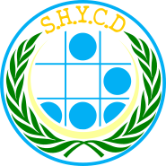

# SHYCD logo

  

Vector logo of SHYCD, a community of [hackers](http://www.catb.org/jargon/html/H/hacker.html), in the original sense of the word, focused on projects with a positive social impact. SHYCD was founded on January 24, 2011 in Dolores, Uruguay.

## The emblem

- **Glider.** The glider from Conway's Game of Life, proposed by Eric S. Raymond as the [hacker emblem](http://www.catb.org/hacker-emblem/faqs.html). Sky blue, like the outer ring.
- **Laurel wreath.** Green.
- **Aureola.** Light yellow, behind the glider. Chosen for aesthetic reasons and as a crown.
- **Wordmark.** "S.H.Y.C.D" in TypeWrong, a typewriter face, in yellow.

The logo was drawn in 2011, reusing elements of a 2010 banner and taking cues from the activist emblems of the time. It was vectorized in 2019.

## Files

- `SHYCD.svg`: the logo. Plain SVG, every element outlined, page cropped to the artwork.
- `SHYCD.png`: 1024 × 1024, transparent background.
- `SHYCD_white_background.png`: the same on white.
- `palette.gpl`: the colors used, as a GIMP palette that Inkscape and GIMP can load.
- `dev/`: the editable Inkscape source and the build scripts. See [`dev/README.md`](dev/README.md).
- `archive/`: the original 2011 and 2012 raster logos and the construction files of the 2019 vectorization.

## License

Copyright © 2011 SHYCD, Carlos Andrés Planchón Prestes.

The logo artwork in this repository is licensed under the [Creative Commons Attribution 4.0 International License](https://creativecommons.org/licenses/by/4.0/) (CC BY 4.0). See [LICENSE](LICENSE).

The logo identifies SHYCD. You may reproduce it to refer to SHYCD, but not in a way that suggests affiliation with or endorsement by SHYCD, or to identify another project.
